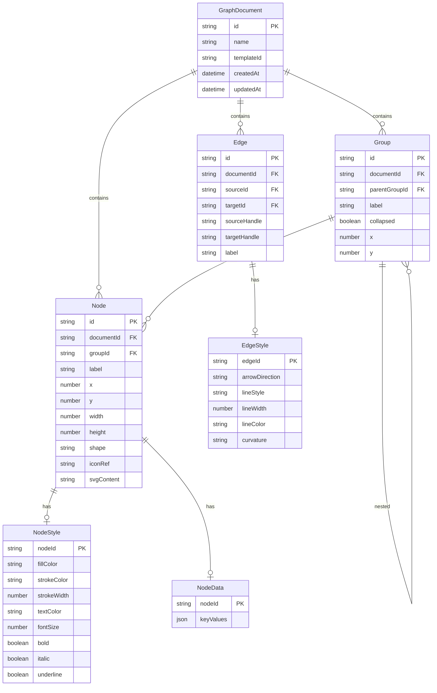

## 1. 架构设计

```mermaid
graph TB
    "前端 Vue 3 应用" --> "Pinia 状态管理"
    "Pinia 状态管理" --> "Graph Store（图数据）"
    "Pinia 状态管理" --> "History Store（撤销重做）"
    "Pinia 状态管理" --> "Theme Store（主题）"
    "Pinia 状态管理" --> "UI Store（界面状态）"
    "Graph Store" --> "IndexedDB 持久化"
    "Graph Store" --> "localStorage 缓存"
    "前端 Vue 3 应用" --> "SVG 渲染引擎"
    "SVG 渲染引擎" --> "节点渲染器"
    "SVG 渲染引擎" --> "边渲染器"
    "SVG 渲染引擎" --> "小地图渲染器"
    "前端 Vue 3 应用" --> "布局算法引擎"
    "布局算法引擎" --> "力导向布局"
    "布局算法引擎" --> "层次布局"
    "布局算法引擎" --> "树形布局"
    "布局算法引擎" --> "网格布局"
    "布局算法引擎" --> "圆形布局"
    "前端 Vue 3 应用" --> "导入导出引擎"
    "导入导出引擎" --> "JSON/GraphML/DOT 解析器"
    "导入导出引擎" --> "PNG/SVG/PDF 生成器"
```

## 2. 技术说明

- **前端框架**：Vue 3 + Vite + Pinia
- **渲染方案**：SVG 画布（原生 SVG DOM 操作，不依赖第三方图渲染库）
- **状态管理**：Pinia（Graph Store / History Store / Theme Store / UI Store）
- **持久化**：IndexedDB（存储完整图数据）+ localStorage（存储用户偏好/主题/最近打开）
- **布局算法**：自行实现五种算法，力导向参考 d3-force 物理模拟思路
- **图标库**：lucide-vue-next + @mdi/js
- **导出**：Canvas API（PNG）、SVG 序列化（SVG）、jsPDF（PDF）
- **富文本**：contenteditable + 自定义工具栏
- **剪贴板**：Clipboard API（跨 tab 粘贴 JSON）
- **端口**：5173

## 3. 路由定义

| 路由 | 用途 |
|------|------|
| / | 编辑器主页（含模板选择入口） |
| /template/:id | 基于模板创建新图 |

## 4. 数据模型

### 4.1 核心数据模型



### 4.2 TypeScript 类型定义

```typescript
type NodeShape = 'rectangle' | 'ellipse' | 'diamond' | 'hexagon' | 'parallelogram' | 'roundedRect'
type ArrowDirection = 'unidirectional' | 'bidirectional' | 'none'
type LineStyle = 'solid' | 'dashed' | 'dotted'
type Curvature = 'straight' | 'arc' | 'polyline'
type LayoutAlgorithm = 'force' | 'hierarchical' | 'tree' | 'grid' | 'circular'
type ThemeName = 'light' | 'dark' | 'print' | 'ocean'

interface GraphDocument {
  id: string
  name: string
  templateId?: string
  nodes: GraphNode[]
  edges: GraphEdge[]
  groups: GraphGroup[]
  createdAt: number
  updatedAt: number
}

interface GraphNode {
  id: string
  groupId?: string
  label: string
  x: number
  y: number
  width: number
  height: number
  shape: NodeShape
  iconRef?: string
  svgContent?: string
  style: NodeStyle
  data: Record<string, string>
  richText?: string
}

interface NodeStyle {
  fillColor: string
  strokeColor: string
  strokeWidth: number
  textColor: string
  fontSize: number
  bold: boolean
  italic: boolean
  underline: boolean
}

interface GraphEdge {
  id: string
  sourceId: string
  targetId: string
  sourceHandle?: string
  targetHandle?: string
  label?: string
  style: EdgeStyle
}

interface EdgeStyle {
  arrowDirection: ArrowDirection
  lineStyle: LineStyle
  lineWidth: number
  lineColor: string
  curvature: Curvature
}

interface GraphGroup {
  id: string
  parentGroupId?: string
  label: string
  collapsed: boolean
  x: number
  y: number
  childNodeIds: string[]
  childGroupIds: string[]
}

interface HistoryEntry {
  timestamp: number
  snapshot: string
  action: string
}

interface Viewport {
  x: number
  y: number
  zoom: number
}
```

## 5. 文件结构

```
src/
├── App.vue
├── main.ts
├── stores/
│   ├── graph.ts          # Graph Store - 节点/边/组 CRUD
│   ├── history.ts        # History Store - 撤销重做
│   ├── theme.ts          # Theme Store - 主题切换
│   └── ui.ts             # UI Store - 选中/视口/工具状态
├── components/
│   ├── canvas/
│   │   ├── SvgCanvas.vue       # SVG 主画布容器
│   │   ├── GridOverlay.vue     # 网格叠加层
│   │   ├── MiniMap.vue         # 小地图
│   │   └── SelectionBox.vue    # 框选矩形
│   ├── nodes/
│   │   ├── NodeRenderer.vue    # 节点渲染入口
│   │   ├── shapes/
│   │   │   ├── RectangleShape.vue
│   │   │   ├── EllipseShape.vue
│   │   │   ├── DiamondShape.vue
│   │   │   ├── HexagonShape.vue
│   │   │   ├── ParallelogramShape.vue
│   │   │   └── RoundedRectShape.vue
│   │   ├── NodeHandle.vue      # 节点连接手柄
│   │   ├── NodeLabel.vue       # 节点文字标签
│   │   └── NodeTooltip.vue     # 节点悬停提示
│   ├── edges/
│   │   ├── EdgeRenderer.vue    # 边渲染入口
│   │   ├── StraightEdge.vue    # 直线边
│   │   ├── ArcEdge.vue         # 弧线边
│   │   ├── PolylineEdge.vue    # 折线边
│   │   ├── EdgeLabel.vue       # 边标签
│   │   └── EdgeArrow.vue       # 边箭头
│   ├── panels/
│   │   ├── PropertyPanel.vue   # 属性面板
│   │   ├── RichTextEditor.vue  # 富文本编辑器
│   │   ├── KeyValueEditor.vue  # key-value 元数据编辑
│   │   └── NodeCreatePanel.vue # 节点创建面板
│   ├── toolbar/
│   │   ├── Toolbar.vue         # 左侧工具栏
│   │   └── TopBar.vue          # 顶部操作栏
│   ├── menus/
│   │   ├── ContextMenu.vue     # 右键菜单
│   │   └── ShapePicker.vue     # 形状选择器
│   └── modals/
│       ├── TemplateModal.vue   # 模板选择弹窗
│       ├── ExportModal.vue     # 导出弹窗
│       ├── ImportModal.vue     # 导入弹窗
│       └── IconSearch.vue      # 图标搜索弹窗
├── composables/
│   ├── useDrag.ts              # 拖拽逻辑
│   ├── useSelection.ts         # 选择逻辑
│   ├── useClipboard.ts         # 剪贴板逻辑
│   ├── useKeyboard.ts          # 键盘快捷键
│   ├── useViewport.ts          # 视口缩放平移
│   ├── useGridSnap.ts          # 网格吸附
│   └── useConnection.ts        # 连线交互
├── layouts/
│   ├── forceLayout.ts          # 力导向布局
│   ├── hierarchicalLayout.ts   # 层次布局
│   ├── treeLayout.ts           # 树形布局
│   ├── gridLayout.ts           # 网格布局
│   └── circularLayout.ts       # 圆形布局
├── utils/
│   ├── id.ts                   # ID 生成器
│   ├── svgShapes.ts            # SVG 形状路径计算
│   ├── exportJson.ts           # JSON 导出
│   ├── exportGraphML.ts        # GraphML 导出
│   ├── exportDot.ts            # DOT 导出
│   ├── exportPng.ts            # PNG 导出
│   ├── exportSvg.ts            # SVG 导出
│   ├── exportPdf.ts            # PDF 导出
│   ├── importJson.ts           # JSON 导入
│   ├── importGraphML.ts        # GraphML 导入
│   ├── importDot.ts            # DOT 导入
│   ├── persistence.ts          # IndexedDB 持久化
│   ├── themes.ts               # 主题定义
│   └── templates.ts            # 模板数据
└── types/
    └── index.ts                # TypeScript 类型定义
```

## 6. Pinia Store 设计

### 6.1 Graph Store

```typescript
// 核心 CRUD 操作
addNode(node: GraphNode)
updateNode(id: string, partial: Partial<GraphNode>)
removeNode(id: string)
addEdge(edge: GraphEdge)
updateEdge(id: string, partial: Partial<GraphEdge>)
removeEdge(id: string)
addGroup(group: GraphGroup)
updateGroup(id: string, partial: Partial<GraphGroup>)
removeGroup(id: string)
toggleGroupCollapse(id: string)
```

### 6.2 History Store

```typescript
// 撤销重做，50步栈
pushHistory(entry: HistoryEntry)
undo(): HistoryEntry | null
redo(): HistoryEntry | null
canUndo: boolean
canRedo: boolean
```

### 6.3 Theme Store

```typescript
currentTheme: ThemeName
setTheme(theme: ThemeName)
themeColors: computed
```

### 6.4 UI Store

```typescript
selectedNodeIds: string[]
selectedEdgeIds: string[]
hoveredNodeId: string | null
viewport: Viewport
isPanning: boolean
isBoxSelecting: boolean
activeTool: 'select' | 'connect' | 'pan'
searchQuery: string
searchResults: string[]
```

## 7. 持久化策略

- **IndexedDB**：存储完整 GraphDocument，key 为文档 ID，每次变更 debounce 500ms 后自动保存
- **localStorage**：存储当前文档 ID、主题偏好、最近打开列表、视口位置
- **恢复机制**：页面加载时从 IndexedDB 读取当前文档，如无则创建空白文档
